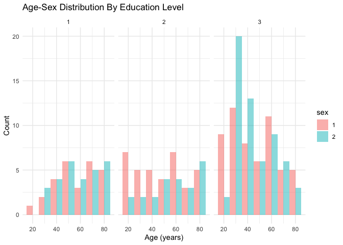
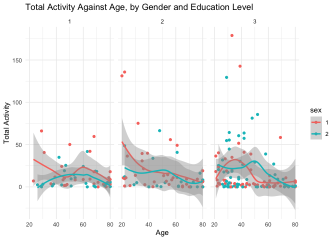

hy2912_p8105_hw3
================
Helen Yousaf
2024-10-07

``` r
library(readr)
library(tidyverse)
```

    ## ── Attaching core tidyverse packages ──────────────────────── tidyverse 2.0.0 ──
    ## ✔ dplyr     1.1.4     ✔ purrr     1.0.2
    ## ✔ forcats   1.0.0     ✔ stringr   1.5.1
    ## ✔ ggplot2   3.5.1     ✔ tibble    3.2.1
    ## ✔ lubridate 1.9.3     ✔ tidyr     1.3.1
    ## ── Conflicts ────────────────────────────────────────── tidyverse_conflicts() ──
    ## ✖ dplyr::filter() masks stats::filter()
    ## ✖ dplyr::lag()    masks stats::lag()
    ## ℹ Use the conflicted package (<http://conflicted.r-lib.org/>) to force all conflicts to become errors

``` r
library(ggridges)
```

# Problem 2

#### MIMS Data

Importing MIMS Demographic data

``` r
MIMS_dg_df = 
  read_csv(file = "/Users/helenyousaf/Desktop/hy2912_p8105_hw3/MIMS.dg.csv", 
           skip = 4, na = c(".", "NA", ""), 
    col_types = cols(
      'SEQN' = col_character(),
      `sex` = col_character(),
      `age` = col_integer(),
      `BMI` = col_double(),
      `education` = col_character(),
    )
  )
```

``` r
names(MIMS_dg_df)
```

    ## [1] "SEQN"      "sex"       "age"       "BMI"       "education"

``` r
MIMS_dg_df = janitor::clean_names(MIMS_dg_df)
```

Importing MIMS Accelerometer data

``` r
MIMS_ac_df = 
  read_csv(file = "/Users/helenyousaf/Desktop/hy2912_p8105_hw3/MIMS.ac.csv", 
           na = c(".", "NA", ""), 
     col_types = cols(
      'SEQN' = col_character(),
    )
  )       
```

``` r
names(MIMS_ac_df)
```

    ##    [1] "SEQN"    "min1"    "min2"    "min3"    "min4"    "min5"    "min6"   
    ##    [8] "min7"    "min8"    "min9"    "min10"   "min11"   "min12"   "min13"  
    ##   [15] "min14"   "min15"   "min16"   "min17"   "min18"   "min19"   "min20"  
    ##   [22] "min21"   "min22"   "min23"   "min24"   "min25"   "min26"   "min27"  
    ##   [29] "min28"   "min29"   "min30"   "min31"   "min32"   "min33"   "min34"  
    ##   [36] "min35"   "min36"   "min37"   "min38"   "min39"   "min40"   "min41"  
    ##   [43] "min42"   "min43"   "min44"   "min45"   "min46"   "min47"   "min48"  
    ##   [50] "min49"   "min50"   "min51"   "min52"   "min53"   "min54"   "min55"  
    ##   [57] "min56"   "min57"   "min58"   "min59"   "min60"   "min61"   "min62"  
    ##   [64] "min63"   "min64"   "min65"   "min66"   "min67"   "min68"   "min69"  
    ##   [71] "min70"   "min71"   "min72"   "min73"   "min74"   "min75"   "min76"  
    ##   [78] "min77"   "min78"   "min79"   "min80"   "min81"   "min82"   "min83"  
    ##   [85] "min84"   "min85"   "min86"   "min87"   "min88"   "min89"   "min90"  
    ##   [92] "min91"   "min92"   "min93"   "min94"   "min95"   "min96"   "min97"  
    ##   [99] "min98"   "min99"   "min100"  "min101"  "min102"  "min103"  "min104" 
    ##  [106] "min105"  "min106"  "min107"  "min108"  "min109"  "min110"  "min111" 
    ##  [113] "min112"  "min113"  "min114"  "min115"  "min116"  "min117"  "min118" 
    ##  [120] "min119"  "min120"  "min121"  "min122"  "min123"  "min124"  "min125" 
    ##  [127] "min126"  "min127"  "min128"  "min129"  "min130"  "min131"  "min132" 
    ##  [134] "min133"  "min134"  "min135"  "min136"  "min137"  "min138"  "min139" 
    ##  [141] "min140"  "min141"  "min142"  "min143"  "min144"  "min145"  "min146" 
    ##  [148] "min147"  "min148"  "min149"  "min150"  "min151"  "min152"  "min153" 
    ##  [155] "min154"  "min155"  "min156"  "min157"  "min158"  "min159"  "min160" 
    ##  [162] "min161"  "min162"  "min163"  "min164"  "min165"  "min166"  "min167" 
    ##  [169] "min168"  "min169"  "min170"  "min171"  "min172"  "min173"  "min174" 
    ##  [176] "min175"  "min176"  "min177"  "min178"  "min179"  "min180"  "min181" 
    ##  [183] "min182"  "min183"  "min184"  "min185"  "min186"  "min187"  "min188" 
    ##  [190] "min189"  "min190"  "min191"  "min192"  "min193"  "min194"  "min195" 
    ##  [197] "min196"  "min197"  "min198"  "min199"  "min200"  "min201"  "min202" 
    ##  [204] "min203"  "min204"  "min205"  "min206"  "min207"  "min208"  "min209" 
    ##  [211] "min210"  "min211"  "min212"  "min213"  "min214"  "min215"  "min216" 
    ##  [218] "min217"  "min218"  "min219"  "min220"  "min221"  "min222"  "min223" 
    ##  [225] "min224"  "min225"  "min226"  "min227"  "min228"  "min229"  "min230" 
    ##  [232] "min231"  "min232"  "min233"  "min234"  "min235"  "min236"  "min237" 
    ##  [239] "min238"  "min239"  "min240"  "min241"  "min242"  "min243"  "min244" 
    ##  [246] "min245"  "min246"  "min247"  "min248"  "min249"  "min250"  "min251" 
    ##  [253] "min252"  "min253"  "min254"  "min255"  "min256"  "min257"  "min258" 
    ##  [260] "min259"  "min260"  "min261"  "min262"  "min263"  "min264"  "min265" 
    ##  [267] "min266"  "min267"  "min268"  "min269"  "min270"  "min271"  "min272" 
    ##  [274] "min273"  "min274"  "min275"  "min276"  "min277"  "min278"  "min279" 
    ##  [281] "min280"  "min281"  "min282"  "min283"  "min284"  "min285"  "min286" 
    ##  [288] "min287"  "min288"  "min289"  "min290"  "min291"  "min292"  "min293" 
    ##  [295] "min294"  "min295"  "min296"  "min297"  "min298"  "min299"  "min300" 
    ##  [302] "min301"  "min302"  "min303"  "min304"  "min305"  "min306"  "min307" 
    ##  [309] "min308"  "min309"  "min310"  "min311"  "min312"  "min313"  "min314" 
    ##  [316] "min315"  "min316"  "min317"  "min318"  "min319"  "min320"  "min321" 
    ##  [323] "min322"  "min323"  "min324"  "min325"  "min326"  "min327"  "min328" 
    ##  [330] "min329"  "min330"  "min331"  "min332"  "min333"  "min334"  "min335" 
    ##  [337] "min336"  "min337"  "min338"  "min339"  "min340"  "min341"  "min342" 
    ##  [344] "min343"  "min344"  "min345"  "min346"  "min347"  "min348"  "min349" 
    ##  [351] "min350"  "min351"  "min352"  "min353"  "min354"  "min355"  "min356" 
    ##  [358] "min357"  "min358"  "min359"  "min360"  "min361"  "min362"  "min363" 
    ##  [365] "min364"  "min365"  "min366"  "min367"  "min368"  "min369"  "min370" 
    ##  [372] "min371"  "min372"  "min373"  "min374"  "min375"  "min376"  "min377" 
    ##  [379] "min378"  "min379"  "min380"  "min381"  "min382"  "min383"  "min384" 
    ##  [386] "min385"  "min386"  "min387"  "min388"  "min389"  "min390"  "min391" 
    ##  [393] "min392"  "min393"  "min394"  "min395"  "min396"  "min397"  "min398" 
    ##  [400] "min399"  "min400"  "min401"  "min402"  "min403"  "min404"  "min405" 
    ##  [407] "min406"  "min407"  "min408"  "min409"  "min410"  "min411"  "min412" 
    ##  [414] "min413"  "min414"  "min415"  "min416"  "min417"  "min418"  "min419" 
    ##  [421] "min420"  "min421"  "min422"  "min423"  "min424"  "min425"  "min426" 
    ##  [428] "min427"  "min428"  "min429"  "min430"  "min431"  "min432"  "min433" 
    ##  [435] "min434"  "min435"  "min436"  "min437"  "min438"  "min439"  "min440" 
    ##  [442] "min441"  "min442"  "min443"  "min444"  "min445"  "min446"  "min447" 
    ##  [449] "min448"  "min449"  "min450"  "min451"  "min452"  "min453"  "min454" 
    ##  [456] "min455"  "min456"  "min457"  "min458"  "min459"  "min460"  "min461" 
    ##  [463] "min462"  "min463"  "min464"  "min465"  "min466"  "min467"  "min468" 
    ##  [470] "min469"  "min470"  "min471"  "min472"  "min473"  "min474"  "min475" 
    ##  [477] "min476"  "min477"  "min478"  "min479"  "min480"  "min481"  "min482" 
    ##  [484] "min483"  "min484"  "min485"  "min486"  "min487"  "min488"  "min489" 
    ##  [491] "min490"  "min491"  "min492"  "min493"  "min494"  "min495"  "min496" 
    ##  [498] "min497"  "min498"  "min499"  "min500"  "min501"  "min502"  "min503" 
    ##  [505] "min504"  "min505"  "min506"  "min507"  "min508"  "min509"  "min510" 
    ##  [512] "min511"  "min512"  "min513"  "min514"  "min515"  "min516"  "min517" 
    ##  [519] "min518"  "min519"  "min520"  "min521"  "min522"  "min523"  "min524" 
    ##  [526] "min525"  "min526"  "min527"  "min528"  "min529"  "min530"  "min531" 
    ##  [533] "min532"  "min533"  "min534"  "min535"  "min536"  "min537"  "min538" 
    ##  [540] "min539"  "min540"  "min541"  "min542"  "min543"  "min544"  "min545" 
    ##  [547] "min546"  "min547"  "min548"  "min549"  "min550"  "min551"  "min552" 
    ##  [554] "min553"  "min554"  "min555"  "min556"  "min557"  "min558"  "min559" 
    ##  [561] "min560"  "min561"  "min562"  "min563"  "min564"  "min565"  "min566" 
    ##  [568] "min567"  "min568"  "min569"  "min570"  "min571"  "min572"  "min573" 
    ##  [575] "min574"  "min575"  "min576"  "min577"  "min578"  "min579"  "min580" 
    ##  [582] "min581"  "min582"  "min583"  "min584"  "min585"  "min586"  "min587" 
    ##  [589] "min588"  "min589"  "min590"  "min591"  "min592"  "min593"  "min594" 
    ##  [596] "min595"  "min596"  "min597"  "min598"  "min599"  "min600"  "min601" 
    ##  [603] "min602"  "min603"  "min604"  "min605"  "min606"  "min607"  "min608" 
    ##  [610] "min609"  "min610"  "min611"  "min612"  "min613"  "min614"  "min615" 
    ##  [617] "min616"  "min617"  "min618"  "min619"  "min620"  "min621"  "min622" 
    ##  [624] "min623"  "min624"  "min625"  "min626"  "min627"  "min628"  "min629" 
    ##  [631] "min630"  "min631"  "min632"  "min633"  "min634"  "min635"  "min636" 
    ##  [638] "min637"  "min638"  "min639"  "min640"  "min641"  "min642"  "min643" 
    ##  [645] "min644"  "min645"  "min646"  "min647"  "min648"  "min649"  "min650" 
    ##  [652] "min651"  "min652"  "min653"  "min654"  "min655"  "min656"  "min657" 
    ##  [659] "min658"  "min659"  "min660"  "min661"  "min662"  "min663"  "min664" 
    ##  [666] "min665"  "min666"  "min667"  "min668"  "min669"  "min670"  "min671" 
    ##  [673] "min672"  "min673"  "min674"  "min675"  "min676"  "min677"  "min678" 
    ##  [680] "min679"  "min680"  "min681"  "min682"  "min683"  "min684"  "min685" 
    ##  [687] "min686"  "min687"  "min688"  "min689"  "min690"  "min691"  "min692" 
    ##  [694] "min693"  "min694"  "min695"  "min696"  "min697"  "min698"  "min699" 
    ##  [701] "min700"  "min701"  "min702"  "min703"  "min704"  "min705"  "min706" 
    ##  [708] "min707"  "min708"  "min709"  "min710"  "min711"  "min712"  "min713" 
    ##  [715] "min714"  "min715"  "min716"  "min717"  "min718"  "min719"  "min720" 
    ##  [722] "min721"  "min722"  "min723"  "min724"  "min725"  "min726"  "min727" 
    ##  [729] "min728"  "min729"  "min730"  "min731"  "min732"  "min733"  "min734" 
    ##  [736] "min735"  "min736"  "min737"  "min738"  "min739"  "min740"  "min741" 
    ##  [743] "min742"  "min743"  "min744"  "min745"  "min746"  "min747"  "min748" 
    ##  [750] "min749"  "min750"  "min751"  "min752"  "min753"  "min754"  "min755" 
    ##  [757] "min756"  "min757"  "min758"  "min759"  "min760"  "min761"  "min762" 
    ##  [764] "min763"  "min764"  "min765"  "min766"  "min767"  "min768"  "min769" 
    ##  [771] "min770"  "min771"  "min772"  "min773"  "min774"  "min775"  "min776" 
    ##  [778] "min777"  "min778"  "min779"  "min780"  "min781"  "min782"  "min783" 
    ##  [785] "min784"  "min785"  "min786"  "min787"  "min788"  "min789"  "min790" 
    ##  [792] "min791"  "min792"  "min793"  "min794"  "min795"  "min796"  "min797" 
    ##  [799] "min798"  "min799"  "min800"  "min801"  "min802"  "min803"  "min804" 
    ##  [806] "min805"  "min806"  "min807"  "min808"  "min809"  "min810"  "min811" 
    ##  [813] "min812"  "min813"  "min814"  "min815"  "min816"  "min817"  "min818" 
    ##  [820] "min819"  "min820"  "min821"  "min822"  "min823"  "min824"  "min825" 
    ##  [827] "min826"  "min827"  "min828"  "min829"  "min830"  "min831"  "min832" 
    ##  [834] "min833"  "min834"  "min835"  "min836"  "min837"  "min838"  "min839" 
    ##  [841] "min840"  "min841"  "min842"  "min843"  "min844"  "min845"  "min846" 
    ##  [848] "min847"  "min848"  "min849"  "min850"  "min851"  "min852"  "min853" 
    ##  [855] "min854"  "min855"  "min856"  "min857"  "min858"  "min859"  "min860" 
    ##  [862] "min861"  "min862"  "min863"  "min864"  "min865"  "min866"  "min867" 
    ##  [869] "min868"  "min869"  "min870"  "min871"  "min872"  "min873"  "min874" 
    ##  [876] "min875"  "min876"  "min877"  "min878"  "min879"  "min880"  "min881" 
    ##  [883] "min882"  "min883"  "min884"  "min885"  "min886"  "min887"  "min888" 
    ##  [890] "min889"  "min890"  "min891"  "min892"  "min893"  "min894"  "min895" 
    ##  [897] "min896"  "min897"  "min898"  "min899"  "min900"  "min901"  "min902" 
    ##  [904] "min903"  "min904"  "min905"  "min906"  "min907"  "min908"  "min909" 
    ##  [911] "min910"  "min911"  "min912"  "min913"  "min914"  "min915"  "min916" 
    ##  [918] "min917"  "min918"  "min919"  "min920"  "min921"  "min922"  "min923" 
    ##  [925] "min924"  "min925"  "min926"  "min927"  "min928"  "min929"  "min930" 
    ##  [932] "min931"  "min932"  "min933"  "min934"  "min935"  "min936"  "min937" 
    ##  [939] "min938"  "min939"  "min940"  "min941"  "min942"  "min943"  "min944" 
    ##  [946] "min945"  "min946"  "min947"  "min948"  "min949"  "min950"  "min951" 
    ##  [953] "min952"  "min953"  "min954"  "min955"  "min956"  "min957"  "min958" 
    ##  [960] "min959"  "min960"  "min961"  "min962"  "min963"  "min964"  "min965" 
    ##  [967] "min966"  "min967"  "min968"  "min969"  "min970"  "min971"  "min972" 
    ##  [974] "min973"  "min974"  "min975"  "min976"  "min977"  "min978"  "min979" 
    ##  [981] "min980"  "min981"  "min982"  "min983"  "min984"  "min985"  "min986" 
    ##  [988] "min987"  "min988"  "min989"  "min990"  "min991"  "min992"  "min993" 
    ##  [995] "min994"  "min995"  "min996"  "min997"  "min998"  "min999"  "min1000"
    ## [1002] "min1001" "min1002" "min1003" "min1004" "min1005" "min1006" "min1007"
    ## [1009] "min1008" "min1009" "min1010" "min1011" "min1012" "min1013" "min1014"
    ## [1016] "min1015" "min1016" "min1017" "min1018" "min1019" "min1020" "min1021"
    ## [1023] "min1022" "min1023" "min1024" "min1025" "min1026" "min1027" "min1028"
    ## [1030] "min1029" "min1030" "min1031" "min1032" "min1033" "min1034" "min1035"
    ## [1037] "min1036" "min1037" "min1038" "min1039" "min1040" "min1041" "min1042"
    ## [1044] "min1043" "min1044" "min1045" "min1046" "min1047" "min1048" "min1049"
    ## [1051] "min1050" "min1051" "min1052" "min1053" "min1054" "min1055" "min1056"
    ## [1058] "min1057" "min1058" "min1059" "min1060" "min1061" "min1062" "min1063"
    ## [1065] "min1064" "min1065" "min1066" "min1067" "min1068" "min1069" "min1070"
    ## [1072] "min1071" "min1072" "min1073" "min1074" "min1075" "min1076" "min1077"
    ## [1079] "min1078" "min1079" "min1080" "min1081" "min1082" "min1083" "min1084"
    ## [1086] "min1085" "min1086" "min1087" "min1088" "min1089" "min1090" "min1091"
    ## [1093] "min1092" "min1093" "min1094" "min1095" "min1096" "min1097" "min1098"
    ## [1100] "min1099" "min1100" "min1101" "min1102" "min1103" "min1104" "min1105"
    ## [1107] "min1106" "min1107" "min1108" "min1109" "min1110" "min1111" "min1112"
    ## [1114] "min1113" "min1114" "min1115" "min1116" "min1117" "min1118" "min1119"
    ## [1121] "min1120" "min1121" "min1122" "min1123" "min1124" "min1125" "min1126"
    ## [1128] "min1127" "min1128" "min1129" "min1130" "min1131" "min1132" "min1133"
    ## [1135] "min1134" "min1135" "min1136" "min1137" "min1138" "min1139" "min1140"
    ## [1142] "min1141" "min1142" "min1143" "min1144" "min1145" "min1146" "min1147"
    ## [1149] "min1148" "min1149" "min1150" "min1151" "min1152" "min1153" "min1154"
    ## [1156] "min1155" "min1156" "min1157" "min1158" "min1159" "min1160" "min1161"
    ## [1163] "min1162" "min1163" "min1164" "min1165" "min1166" "min1167" "min1168"
    ## [1170] "min1169" "min1170" "min1171" "min1172" "min1173" "min1174" "min1175"
    ## [1177] "min1176" "min1177" "min1178" "min1179" "min1180" "min1181" "min1182"
    ## [1184] "min1183" "min1184" "min1185" "min1186" "min1187" "min1188" "min1189"
    ## [1191] "min1190" "min1191" "min1192" "min1193" "min1194" "min1195" "min1196"
    ## [1198] "min1197" "min1198" "min1199" "min1200" "min1201" "min1202" "min1203"
    ## [1205] "min1204" "min1205" "min1206" "min1207" "min1208" "min1209" "min1210"
    ## [1212] "min1211" "min1212" "min1213" "min1214" "min1215" "min1216" "min1217"
    ## [1219] "min1218" "min1219" "min1220" "min1221" "min1222" "min1223" "min1224"
    ## [1226] "min1225" "min1226" "min1227" "min1228" "min1229" "min1230" "min1231"
    ## [1233] "min1232" "min1233" "min1234" "min1235" "min1236" "min1237" "min1238"
    ## [1240] "min1239" "min1240" "min1241" "min1242" "min1243" "min1244" "min1245"
    ## [1247] "min1246" "min1247" "min1248" "min1249" "min1250" "min1251" "min1252"
    ## [1254] "min1253" "min1254" "min1255" "min1256" "min1257" "min1258" "min1259"
    ## [1261] "min1260" "min1261" "min1262" "min1263" "min1264" "min1265" "min1266"
    ## [1268] "min1267" "min1268" "min1269" "min1270" "min1271" "min1272" "min1273"
    ## [1275] "min1274" "min1275" "min1276" "min1277" "min1278" "min1279" "min1280"
    ## [1282] "min1281" "min1282" "min1283" "min1284" "min1285" "min1286" "min1287"
    ## [1289] "min1288" "min1289" "min1290" "min1291" "min1292" "min1293" "min1294"
    ## [1296] "min1295" "min1296" "min1297" "min1298" "min1299" "min1300" "min1301"
    ## [1303] "min1302" "min1303" "min1304" "min1305" "min1306" "min1307" "min1308"
    ## [1310] "min1309" "min1310" "min1311" "min1312" "min1313" "min1314" "min1315"
    ## [1317] "min1316" "min1317" "min1318" "min1319" "min1320" "min1321" "min1322"
    ## [1324] "min1323" "min1324" "min1325" "min1326" "min1327" "min1328" "min1329"
    ## [1331] "min1330" "min1331" "min1332" "min1333" "min1334" "min1335" "min1336"
    ## [1338] "min1337" "min1338" "min1339" "min1340" "min1341" "min1342" "min1343"
    ## [1345] "min1344" "min1345" "min1346" "min1347" "min1348" "min1349" "min1350"
    ## [1352] "min1351" "min1352" "min1353" "min1354" "min1355" "min1356" "min1357"
    ## [1359] "min1358" "min1359" "min1360" "min1361" "min1362" "min1363" "min1364"
    ## [1366] "min1365" "min1366" "min1367" "min1368" "min1369" "min1370" "min1371"
    ## [1373] "min1372" "min1373" "min1374" "min1375" "min1376" "min1377" "min1378"
    ## [1380] "min1379" "min1380" "min1381" "min1382" "min1383" "min1384" "min1385"
    ## [1387] "min1386" "min1387" "min1388" "min1389" "min1390" "min1391" "min1392"
    ## [1394] "min1393" "min1394" "min1395" "min1396" "min1397" "min1398" "min1399"
    ## [1401] "min1400" "min1401" "min1402" "min1403" "min1404" "min1405" "min1406"
    ## [1408] "min1407" "min1408" "min1409" "min1410" "min1411" "min1412" "min1413"
    ## [1415] "min1414" "min1415" "min1416" "min1417" "min1418" "min1419" "min1420"
    ## [1422] "min1421" "min1422" "min1423" "min1424" "min1425" "min1426" "min1427"
    ## [1429] "min1428" "min1429" "min1430" "min1431" "min1432" "min1433" "min1434"
    ## [1436] "min1435" "min1436" "min1437" "min1438" "min1439" "min1440"

``` r
MIMS_ac_df = janitor::clean_names(MIMS_ac_df)
```

Joining data sets to form MIMS_comb_df

``` r
MIMS_comb_df = 
  left_join (MIMS_dg_df, MIMS_ac_df, by = "seqn") 
```

``` r
MIMS_comb_df = 
  drop_na(MIMS_comb_df) |>
  filter ("age" >= 21) |>
  mutate(across(c(sex, education), as.factor)
)
```

Gender and Education Summary Table

``` r
gender_ed_df <- MIMS_comb_df |>
  group_by(education, sex) |>
  summarise(count = n()) |>
  pivot_wider(names_from = sex, values_from = count, values_fill = 0)
```

    ## `summarise()` has grouped output by 'education'. You can override using the
    ## `.groups` argument.

``` r
gender_ed_df
```

    ## # A tibble: 3 × 3
    ## # Groups:   education [3]
    ##   education   `1`   `2`
    ##   <fct>     <int> <int>
    ## 1 1            27    28
    ## 2 2            36    23
    ## 3 3            56    59

Visualization of the Age-Sex Distribution by Education Level

``` r
ggplot(MIMS_comb_df, aes(x = age, fill = sex)) +
  geom_histogram(position = "dodge", binwidth = 10, alpha = 0.5) +
  facet_wrap(~ education) +
  labs(title = "Age-Sex Distribution By Education Level",
       x = "Age (years)",
       y = "Count") +
  theme_minimal()
```

<!-- -->
Total activity dataset

``` r
total_activity_df <- MIMS_comb_df |>
  group_by(seqn, age, sex, education) |>
  summarise(total_activity = sum(min1:min1440, na.rm = TRUE)) 
```

    ## `summarise()` has grouped output by 'seqn', 'age', 'sex'. You can override
    ## using the `.groups` argument.

``` r
total_activity_df
```

    ## # A tibble: 229 × 5
    ## # Groups:   seqn, age, sex [229]
    ##    seqn    age sex   education total_activity
    ##    <chr> <int> <fct> <fct>              <dbl>
    ##  1 62161    22 1     2                  1.11 
    ##  2 62164    44 2     3                  8.77 
    ##  3 62169    21 1     2                 10.7  
    ##  4 62174    80 1     3                  5.42 
    ##  5 62177    51 1     2                 13.3  
    ##  6 62178    80 1     2                  0.167
    ##  7 62180    35 1     3                  1.08 
    ##  8 62184    26 1     2                  1.55 
    ##  9 62189    30 2     3                 17.2  
    ## 10 62199    57 1     3                  0.031
    ## # ℹ 219 more rows

Plot of total activities against age, by sex and education

``` r
ggplot(total_activity_df, aes(x = age, y = total_activity, color = sex)) +
  geom_point() +
  geom_smooth(method = "loess") +
  facet_wrap(~ education) +
  labs(x = "Age", y = "Total Activity", title = "Total Activity Against Age, by Gender and Education Level") +
  theme_minimal()
```

    ## `geom_smooth()` using formula = 'y ~ x'

<!-- -->
